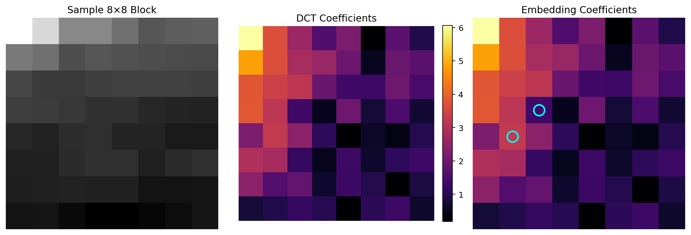
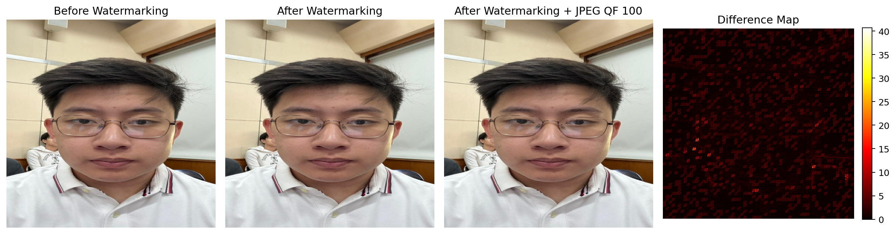
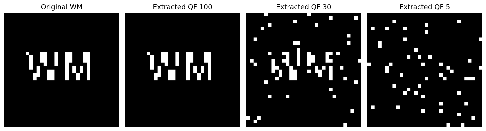
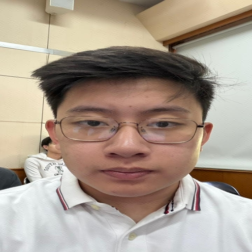

# Invisible Watermarking

Proyek ini mengimplementasikan **invisible watermarking** pada gambar menggunakan metode **DCT (Discrete Cosine Transform)**. Watermark disisipkan ke dalam foto wajah, lalu diuji ketahanannya terhadap kompresi JPEG dengan beberapa nilai **Quality Factor (QF)**.

## Identitas

- **Nama:** Gregory William Sutjipto
- **NIM:** 18224010

---

## Tujuan

Tujuan dari proyek ini adalah:

1. Menyisipkan watermark tersembunyi ke dalam foto wajah sendiri.
2. Menguji apakah watermark masih dapat diekstrak setelah gambar dikompresi menggunakan JPEG.
3. Menentukan batas minimum QF yang masih dapat diterima untuk ekstraksi watermark.

---

## Ringkasan Metode

Metode yang digunakan adalah **DCT-based invisible watermarking**.

Secara umum, alur kerjanya adalah:

1. Foto wajah dibaca dan diubah ukurannya menjadi 512 × 512 piksel.
2. Watermark biner dibuat dengan ukuran 32 × 32 piksel.
3. Gambar dibagi menjadi blok-blok 8 × 8.
4. Setiap blok diproses menggunakan DCT.
5. Bit watermark disisipkan dengan memodifikasi pasangan koefisien DCT tertentu.
6. Gambar hasil watermarking dikompresi menggunakan JPEG dengan berbagai nilai QF.
7. Watermark diekstrak kembali dan dievaluasi menggunakan BER dan Accuracy.

---

# Hasil dan Tahapan Eksperimen

## Step 1 — Preprocessing Gambar

Pada tahap ini, foto wajah dibaca, diubah ke format RGB, diubah ukurannya menjadi **512 × 512 piksel**, lalu disiapkan untuk pemrosesan berbasis blok.

Gambar kemudian dibagi menjadi blok-blok **8 × 8**, karena proses watermarking dengan DCT dilakukan per blok.

**Inti proses:**  
Gambar harus dibuat seragam ukurannya dan dibagi menjadi blok 8 × 8 agar dapat diproses menggunakan DCT.

---

## Step 2 — Pembuatan Watermark Biner

Watermark dibuat sebagai citra biner berukuran **32 × 32 piksel** dengan teks `WM`.

Watermark ini kemudian dikonversi menjadi bit `0` dan `1` sebelum disisipkan ke dalam gambar.

**Inti proses:**  
Watermark tidak ditempel secara langsung sebagai teks yang terlihat, melainkan diubah menjadi pola bit biner.

---

## Step 3 — Penyisipan Watermark dengan DCT

Gambar dikonversi ke ruang warna **YCrCb**, lalu watermark disisipkan ke channel **Y** atau luminance.

Pada setiap blok 8 × 8 yang dipilih, program menghitung DCT, kemudian mengubah dua koefisien DCT tertentu untuk mewakili bit watermark.

Aturan penyisipannya adalah:

- Jika bit watermark bernilai `1`, salah satu koefisien DCT dibuat lebih besar dari koefisien lainnya.
- Jika bit watermark bernilai `0`, urutan koefisien tersebut dibalik.

Dengan cara ini, watermark disimpan di domain frekuensi sehingga tidak terlihat secara langsung oleh mata manusia.

---

## Step 4 — Perbandingan Sebelum dan Sesudah Watermarking

Pada tahap ini, gambar asli dibandingkan dengan gambar setelah watermarking dan gambar setelah watermarking yang dikompresi dengan JPEG pada **QF 100**.

Dari hasil perbandingan, gambar setelah watermarking masih terlihat sangat mirip dengan gambar asli. Perubahan tetap ada, tetapi tidak terlihat jelas secara visual.

**Inti proses:**  
Watermark berhasil disisipkan tanpa membuat perubahan visual yang signifikan pada gambar.

---

## Step 5 — Ekstraksi Watermark

Setelah gambar dikompresi menggunakan JPEG, watermark diekstrak kembali dari gambar hasil kompresi.

Hasil ekstraksi dibandingkan dengan watermark asli untuk melihat apakah watermark masih dapat dikenali.

**Inti proses:**  
Jika watermark hasil ekstraksi masih mirip dengan watermark asli, berarti watermark masih berhasil dipertahankan.

---

# Pengujian Kompresi JPEG

Nilai QF yang diuji adalah:

`100, 95, 90, 80, 70, 60, 50, 40, 30, 20, 10, 5`

Semakin kecil nilai QF, semakin kuat kompresi JPEG yang dilakukan. Kompresi yang lebih kuat dapat merusak informasi watermark yang sudah disisipkan.

Watermark dianggap **OK** apabila memenuhi dua syarat:

1. `QF >= 30`
2. `BER <= 0.30`

Jika salah satu syarat tidak terpenuhi, maka statusnya dianggap **GAGAL**.

---

## Hasil Evaluasi Kuantitatif

| QF | BER | Accuracy | Status |
|---:|---:|---:|---|
| 100 | 0.000000 | 1.000000 | OK |
| 95 | 0.000000 | 1.000000 | OK |
| 90 | 0.000000 | 1.000000 | OK |
| 80 | 0.000000 | 1.000000 | OK |
| 70 | 0.000000 | 1.000000 | OK |
| 60 | 0.000000 | 1.000000 | OK |
| 50 | 0.000000 | 1.000000 | OK |
| 40 | 0.000000 | 1.000000 | OK |
| 30 | 0.045898 | 0.954102 | OK |
| 20 | 0.185547 | 0.814453 | GAGAL |
| 10 | 0.144531 | 0.855469 | GAGAL |
| 5 | 0.089844 | 0.910156 | GAGAL |

---

## Visualisasi BER

Grafik berikut menunjukkan hubungan antara nilai JPEG QF dan nilai BER.

Berdasarkan grafik, watermark masih sangat stabil pada QF 100 hingga QF 40 karena nilai BER tetap 0. Pada QF 30, nilai BER mulai naik menjadi 0.045898, tetapi masih berada di bawah batas maksimum 0.30 sehingga masih dianggap OK.

Pada QF di bawah 30, nilai BER tidak selalu naik secara monoton. Hal ini dapat terjadi karena kompresi JPEG memengaruhi koefisien DCT secara tidak linear. Karena proses ekstraksi watermark bergantung pada perbandingan dua koefisien DCT, kompresi yang lebih kuat kadang dapat membuat sebagian bit terbaca benar kembali secara tidak langsung.

Oleh karena itu, grafik BER tidak harus selalu naik terus ketika QF menurun. Namun, secara umum, QF yang lebih rendah tetap meningkatkan risiko rusaknya watermark.

---

# Contoh Output

## Gambar Asli

---

## Watermark Asli

---

## Gambar Setelah Watermarking

---

## Gambar Setelah Watermarking dan JPEG QF 100

---

## Watermark Hasil Ekstraksi pada QF 100

---

## Watermark Hasil Ekstraksi pada QF 30

---

## Watermark Hasil Ekstraksi pada QF 5

---

# Kesimpulan

Berdasarkan hasil eksperimen, metode **DCT-based invisible watermarking** berhasil menyisipkan watermark ke dalam foto wajah tanpa membuat perubahan visual yang signifikan.

Hasil pengujian menunjukkan bahwa:

- Pada QF **100 hingga 40**, watermark dapat diekstrak secara sempurna dengan BER = 0.
- Pada QF **30**, watermark masih dapat diekstrak dengan baik dengan BER = 0.045898 dan Accuracy = 0.954102.
- Pada QF **20, 10, dan 5**, watermark dianggap gagal karena berada di bawah batas minimum QF yang ditentukan, yaitu 30.

Dengan demikian, batas minimum JPEG Quality Factor yang masih dianggap berhasil dalam eksperimen ini adalah:

## **QF = 30**

---

# Isi Repository

| File / Folder | Keterangan |
|---|---|
| `watermarking.py` | Program utama untuk menyisipkan dan mengekstrak watermark |
| `readme_visuals.py` | Program untuk membuat visualisasi step-by-step pada README |
| `hasil_watermarking/` | Folder berisi hasil gambar, hasil ekstraksi, grafik, dan tabel evaluasi |
| `docs/` | Folder berisi gambar visualisasi step-by-step |
| `README.md` | Dokumentasi proyek |