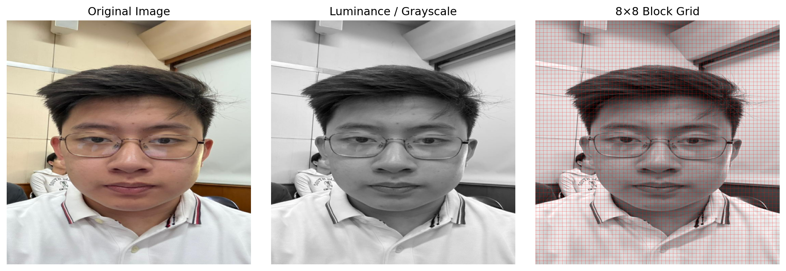
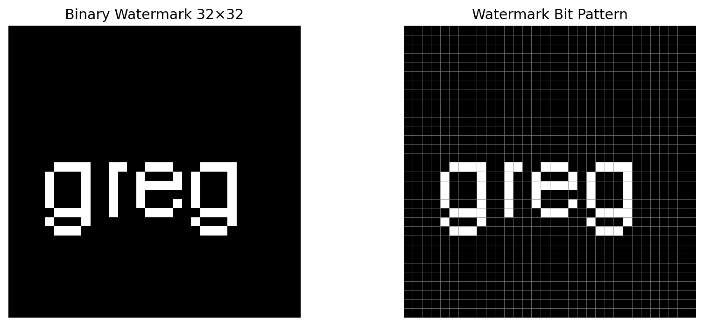
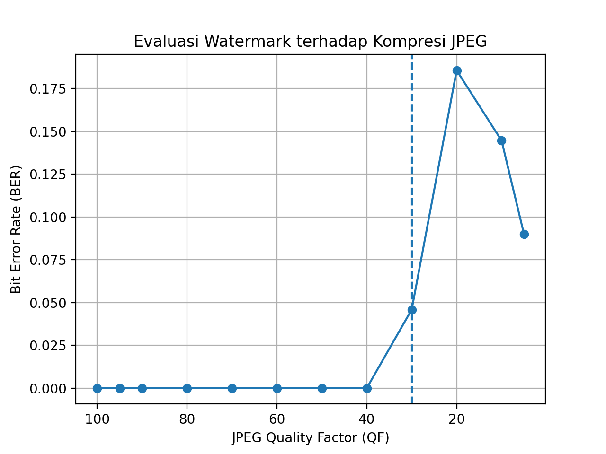
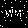

# Invisible Watermarking

This project implements **invisible image watermarking** using the **DCT (Discrete Cosine Transform)** method.  
The watermark is embedded into a face image, then tested against **JPEG compression** at multiple **Quality Factor (QF)** values.

## Identity

- **Name:** Gregory William Sutjipto
- **NIM:** 18224010

---

## Project Objective

The objectives of this project are:

1. To embed an invisible watermark into a personal face image.
2. To evaluate watermark robustness after JPEG compression.
3. To determine the lowest acceptable JPEG quality factor for successful watermark extraction.

---

## Method Overview

The system works as follows:

- The input face image is resized to **512 × 512**
- A binary watermark is created in size **32 × 32**
- The watermark is embedded into the **Y (luminance)** channel
- Embedding is done in the **DCT domain** on **8 × 8 blocks**
- The watermarked image is compressed using JPEG at multiple QF values
- The watermark is extracted again and evaluated using **BER** and **Accuracy**

---

# Results

## Step 1 — Image preprocessing and 8×8 block preparation

At the beginning, the face image is loaded, converted into RGB, resized to **512 × 512**, and prepared for DCT-based processing.  
The image is later divided into **8 × 8 blocks**, because DCT embedding is performed block by block.

**Main idea:**  
This step prepares the image so that watermark embedding can be done in a structured frequency-domain representation.

---

## Step 2 — Binary watermark generation

A binary watermark is created with size **32 × 32** using the text **“WM”**.  
The watermark is converted into bits (`0` and `1`) before being embedded into the image.

**Main idea:**  
The watermark does not appear directly as visible text on the photo, but is represented as a binary pattern.

---

## Step 3 — DCT embedding process

The face image is transformed into the **YCrCb** color space, and the watermark is embedded in the **Y channel**.  
For each selected 8 × 8 block, two DCT coefficients are modified to represent watermark bit `0` or `1`.

**Main idea:**  
The watermark is hidden in the DCT coefficients, making it invisible to the human eye while still possible to recover later.

---

## Step 4 — JPEG compression test

The watermarked image is compressed using JPEG at the following QF values:

`100, 95, 90, 80, 70, 60, 50, 40, 30, 20, 10, 5`

A lower QF means stronger compression and a higher chance that watermark information will be damaged.

**Main idea:**  
This step tests the robustness of the watermark under increasing compression strength.

---

## Step 5 — Watermark extraction and performance evaluation

After compression, the watermark is extracted again from each JPEG image.  
The extraction result is compared to the original watermark using:

- **BER (Bit Error Rate)**  
- **Accuracy**

The watermark is considered **OK** if:

1. `QF >= 30`
2. `BER <= 0.30`

---

## Quantitative Evaluation

| QF | BER | Accuracy | Status |
|---:|---:|---:|---|
| 100 | 0.000000 | 1.000000 | OK |
| 95 | 0.000000 | 1.000000 | OK |
| 90 | 0.000000 | 1.000000 | OK |
| 80 | 0.000000 | 1.000000 | OK |
| 70 | 0.000000 | 1.000000 | OK |
| 60 | 0.000000 | 1.000000 | OK |
| 50 | 0.000000 | 1.000000 | OK |
| 40 | 0.000000 | 1.000000 | OK |
| 30 | 0.045898 | 0.954102 | OK |
| 20 | 0.185547 | 0.814453 | GAGAL |
| 10 | 0.144531 | 0.855469 | GAGAL |
| 5 | 0.089844 | 0.910156 | GAGAL |

---

## BER Visualization

The following graph shows how the **Bit Error Rate (BER)** changes as JPEG quality decreases.

**Observation:**  
For QF values from **100 to 40**, extraction is perfect with BER = 0.  
At **QF 30**, watermark extraction is still acceptable.  
Below **QF 30**, the watermark is considered failed according to the experiment criteria.

---

## Sample Output Images

### Original image

### Original watermark

### Watermarked image

### Extracted watermark without compression

### Extracted watermark at QF 100

### Extracted watermark at QF 30

### Extracted watermark at QF 5

---

## Conclusion

This project successfully embeds an invisible watermark into a face image using the DCT method.

Based on the experiment results:

- Watermark extraction is perfect from **QF 100 to QF 40**
- Watermark is still acceptable at **QF 30**
- Watermark is considered failed below **QF 30**

Therefore, the **minimum acceptable JPEG quality factor** in this experiment is:

## **QF = 30**

---

## Repository Contents

- `watermarking.py` → main program
- `hasil_watermarking/` → output images and evaluation results
- `docs/` → step-by-step visual explanation images
- `README.md` → project documentation